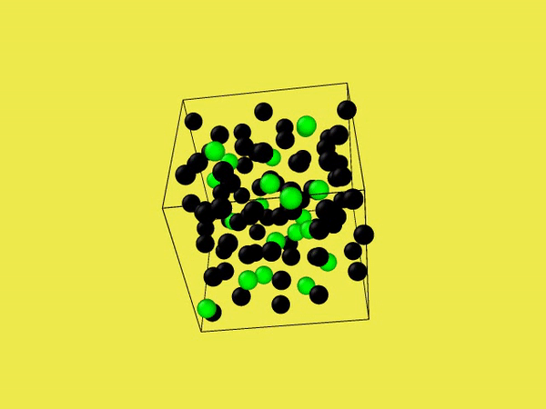

Molecular dynamics for 1000 steps -> Question 5:
black: A atoms, green: B atoms, red arrow: velocity (size of arrow)
and direction representing velocity direction Note: the particle radius has been rescaled in ovito for
better visualization.
